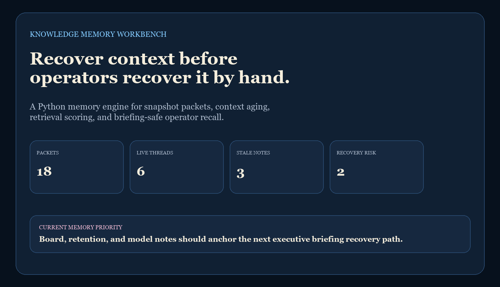
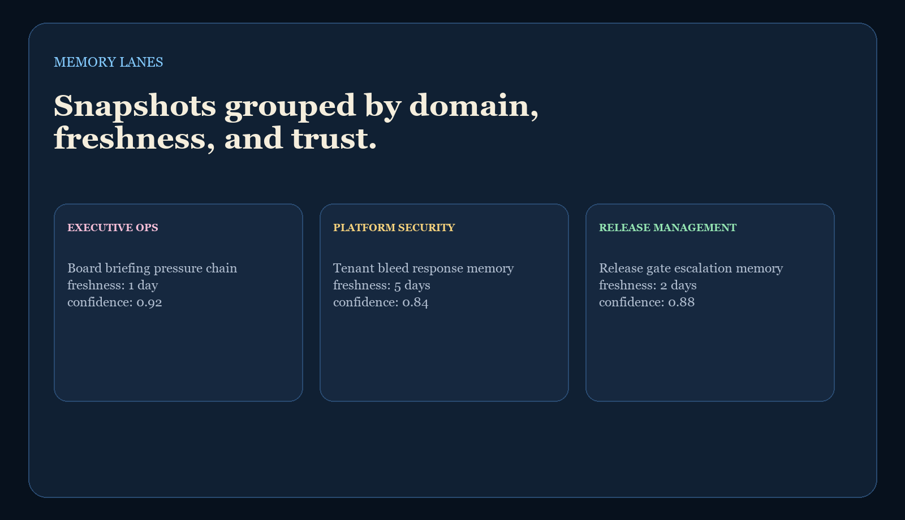
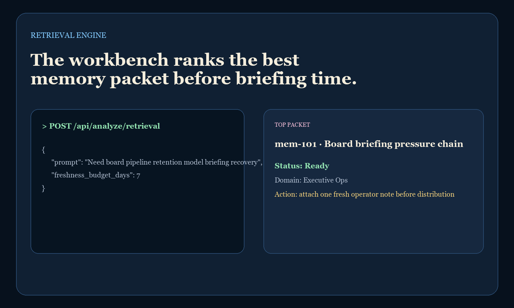
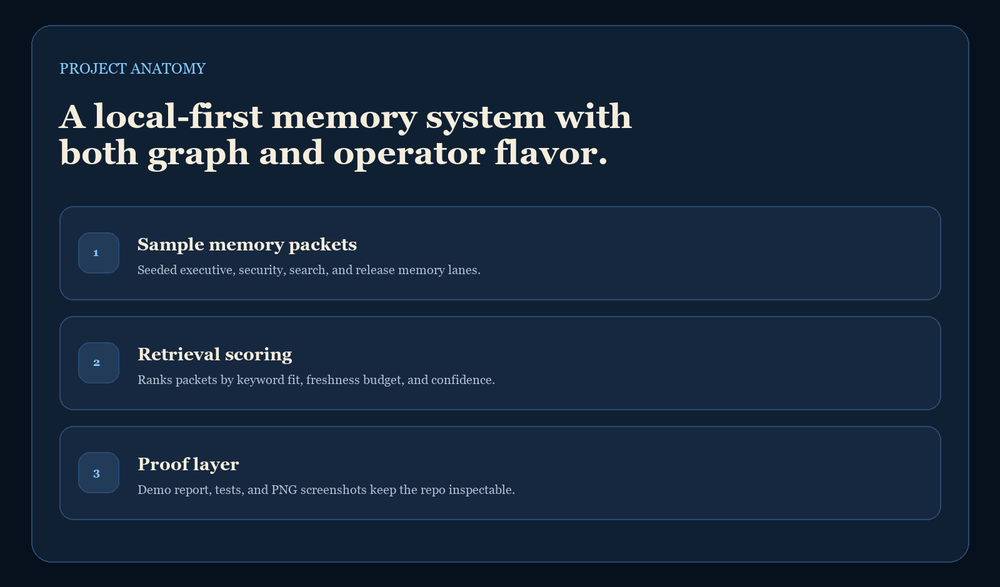

# Knowledge Memory Workbench

`knowledge-memory-workbench` is a Python memory engine for snapshot packets, context aging, retrieval scoring, and operator context recovery.

It is designed for the moment when teams know the relevant knowledge exists somewhere, but not which memory packet is fresh enough, trusted enough, and relevant enough to use without wasting time rebuilding context manually.

## Screenshots

### Hero


### Memory Lanes


### Retrieval Engine


### Anatomy


## Endpoints

- `GET /`
- `GET /docs`
- `GET /api/dashboard/summary`
- `GET /api/packets`
- `GET /api/packets/:id`
- `GET /api/sample`
- `POST /api/analyze/retrieval`

## Local Run

```powershell
Set-Location "C:\Users\chaus\dev\repos\knowledge-memory-workbench"
py -3.11 -m app.main
```

If `4562` is occupied:

```powershell
$env:PORT = "4566"
py -3.11 -m app.main
```

Then open:

- [http://127.0.0.1:4562/](http://127.0.0.1:4562/)
- [http://127.0.0.1:4562/docs](http://127.0.0.1:4562/docs)

## Validation

```powershell
Set-Location "C:\Users\chaus\dev\repos\knowledge-memory-workbench"
py -3.11 -m unittest discover -s tests
py -3.11 scripts\run_demo.py
py -3.11 scripts\smoke_check.py
py -3.11 -m pip install -r requirements-dev.txt
py -3.11 scripts\render_readme_assets.py
```

## Repo Layout

- [app/main.py](C:/Users/chaus/dev/repos/knowledge-memory-workbench/app/main.py)
- [app/services/memory_engine.py](C:/Users/chaus/dev/repos/knowledge-memory-workbench/app/services/memory_engine.py)
- [app/data/sample_memory_data.py](C:/Users/chaus/dev/repos/knowledge-memory-workbench/app/data/sample_memory_data.py)
- [scripts/run_demo.py](C:/Users/chaus/dev/repos/knowledge-memory-workbench/scripts/run_demo.py)
- [docs/architecture.md](C:/Users/chaus/dev/repos/knowledge-memory-workbench/docs/architecture.md)

---

**Connect:** [LinkedIn](https://www.linkedin.com/in/mirzacausevic/) · [Kinetic Gain](https://kineticgain.com) · [Medium](https://medium.com/@mizcausevic/) · [Skills](https://mizcausevic.com/skills/)
